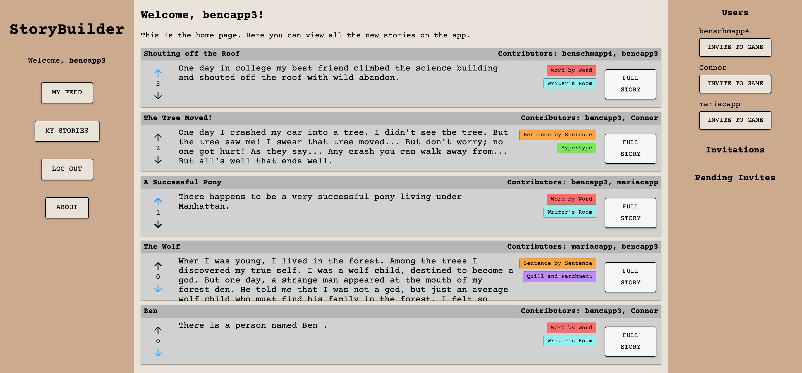
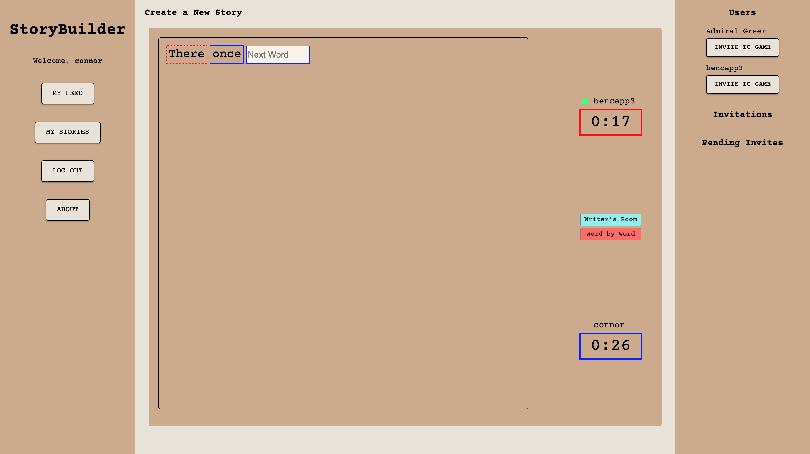

# StoryBuilder

## Description

_Duration: 2 Week Solo Project_

StoryBuilder is a full stack application that allows users to create stories in collaboration with others and share them with a broader network. The core functionality is a timed writing environment where players take turns writing words or sentences, trying to create the most interesting story in a short amount of time! You can try out the fully functioning app [here](https://story-builder-test.herokuapp.com/).

## Screen Shots

## User Stories

1. A user can view a list of movies and their posters on a home page.
2. A user can search for movies by keyword, and movies that contain those keywords in their titles or descriptions will appear in the search.
3. A user can click on movies from the main page to view more information, including the movie description and a list of genres for the movie.
4. A user can edit movie information by clicking an edit button. They are taken to a new page where they can change a movie's title, description, and genres.
5. A user can delete a movie from the database
6. A user can add a new movie by entering a title, image path, description, and appropriate genres.
7. A user can go to a random movie details page by clicking the "random movie button."

## Technologies used

- Node.js
- React.js
- Axios.js
- Express
- PostGres
- PostGreSQL and SQL Joins
- React Redux
- Redux SAGAS
- Material UI
- Material UI Themes
- Socket.IO

## Acknowledgement

- Thanks to Prime Digital Academy, my Amethyst cohort, and instructors Dane, Key, and Edan.
